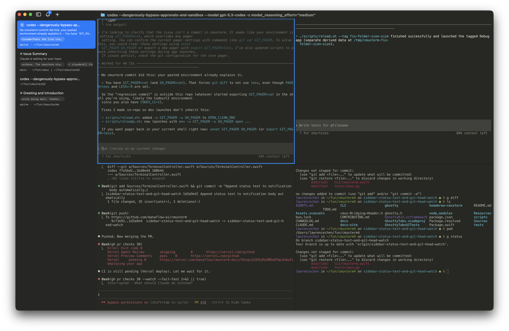

> 이 번역은 Claude에 의해 생성되었습니다. 개선 사항이 있으면 PR을 제출해 주세요.

<p align="center"><a href="README.md">English</a> | <a href="README.zh-CN.md">简体中文</a> | <a href="README.zh-TW.md">繁體中文</a> | 한국어 | <a href="README.de.md">Deutsch</a> | <a href="README.es.md">Español</a> | <a href="README.fr.md">Français</a> | <a href="README.it.md">Italiano</a> | <a href="README.da.md">Dansk</a> | <a href="README.ja.md">日本語</a> | <a href="README.pl.md">Polski</a> | <a href="README.ru.md">Русский</a> | <a href="README.bs.md">Bosanski</a> | <a href="README.ar.md">العربية</a> | <a href="README.no.md">Norsk</a> | <a href="README.pt-BR.md">Português (Brasil)</a> | <a href="README.th.md">ไทย</a> | <a href="README.tr.md">Türkçe</a></p>

<h1 align="center">term-mesh</h1>
<p align="center">AI 코딩 에이전트를 위한 세로 탭과 알림 기능을 갖춘 Ghostty 기반 macOS 터미널</p>

<p align="center">
  <a href="https://github.com/x-mesh/term-mesh/releases/latest/download/term-mesh-macos.dmg">
    
  </a>
</p>

<p align="center">
  
</p>

## 기능

- **세로 탭** — 사이드바에 git 브랜치, 작업 디렉토리, 리스닝 포트, 최신 알림 텍스트 표시
- **알림 링** — AI 에이전트(Claude Code, OpenCode)가 사용자의 주의를 필요로 할 때 패널에 파란색 링이 표시되고 탭이 강조됨
- **알림 패널** — 모든 대기 중인 알림을 한 곳에서 확인하고, 가장 최근의 읽지 않은 알림으로 바로 이동
- **분할 패널** — 수평 및 수직 분할 지원
- **내장 브라우저** — [agent-browser](https://github.com/vercel-labs/agent-browser)에서 포팅된 스크립트 가능한 API를 갖춘 브라우저를 터미널 옆에 분할하여 사용
- **스크립트 가능** — CLI와 socket API로 워크스페이스 생성, 패널 분할, 키 입력 전송, 브라우저 자동화 가능
- **네이티브 macOS 앱** — Swift와 AppKit으로 구축, Electron이 아닙니다. 빠른 시작, 낮은 메모리 사용량.
- **Ghostty 호환** — 기존 `~/.config/ghostty/config`에서 테마, 글꼴, 색상 설정을 읽어옴
- **GPU 가속** — libghostty로 구동되어 부드러운 렌더링 제공

## 설치

### Homebrew (권장)

```bash
brew install --cask x-mesh/tap/term-mesh
```

Cask가 [GitHub Releases](https://github.com/x-mesh/term-mesh/releases)에서 최신 DMG를 받아 `term-mesh.app`을 `/Applications`에 설치하고, Gatekeeper 격리 속성(`com.apple.quarantine`)을 자동으로 제거합니다. 공증되지 않은 빌드지만 별도의 `xattr` 작업 없이 바로 실행됩니다.

번들에 포함된 CLI 도구(`tm-agent`, `term-mesh-run`)는 `$(brew --prefix)/bin`에 심볼릭 링크됩니다.

업데이트 / 제거:

```bash
brew upgrade --cask term-mesh
brew uninstall --cask term-mesh           # 앱 제거
brew uninstall --cask --zap term-mesh     # ~/Library 데이터와 ~/.term-mesh까지 제거
```

#### "App already exists" 오류 대처

DMG로 수동 설치한 term-mesh가 이미 `/Applications`에 있으면 Homebrew가 기존 번들을 덮어쓰지 않고 다음 오류로 중단합니다:

```
Error: It seems there is already an App at '/Applications/term-mesh.app'.
```

`--force`로 Homebrew가 기존 앱을 인계받게 하거나,

```bash
brew install --cask --force x-mesh/tap/term-mesh
```

기존 앱을 먼저 옮긴 뒤 재설치하세요:

```bash
mv /Applications/term-mesh.app ~/Downloads/term-mesh.app.manual-backup
brew install --cask x-mesh/tap/term-mesh
```

두 경우 모두 실행 중인 term-mesh는 먼저 종료해야 합니다.

### DMG (수동)

[최신 릴리스](https://github.com/x-mesh/term-mesh/releases/latest)에서 `term-mesh-macos-<version>.dmg`를 내려받아 열고, `term-mesh.app`을 `/Applications`에 드래그합니다. 공증되지 않은 빌드이므로 복사 후 한 번 실행하세요:

```bash
xattr -dr com.apple.quarantine /Applications/term-mesh.app
```

이후 업데이트는 Sparkle이 자동으로 처리합니다.

## Why term-mesh를 만들었나요?

저는 Claude Code와 Codex 세션을 대량으로 병렬 실행합니다. 이전에는 Ghostty에서 분할 패널을 여러 개 열어놓고, 에이전트가 저를 필요로 할 때 macOS 기본 알림에 의존했습니다. 하지만 Claude Code의 알림 내용은 항상 "Claude is waiting for your input"이라는 맥락 없는 동일한 메시지뿐이었고, 탭이 많아지면 제목조차 읽을 수 없었습니다.

몇 가지 코딩 오케스트레이터를 시도해봤지만, 대부분 Electron/Tauri 앱이어서 성능이 마음에 들지 않았습니다. 또한 GUI 오케스트레이터는 특정 워크플로우에 갇히게 되므로 터미널을 더 선호합니다. 그래서 Swift/AppKit으로 네이티브 macOS 앱인 term-mesh를 만들었습니다. 터미널 렌더링에 libghostty를 사용하고, 기존 Ghostty 설정에서 테마, 글꼴, 색상을 읽어옵니다.

주요 추가 기능은 사이드바와 알림 시스템입니다. 사이드바에는 각 워크스페이스의 git 브랜치, 작업 디렉토리, 리스닝 포트, 최신 알림 텍스트를 보여주는 세로 탭이 있습니다. 알림 시스템은 터미널 시퀀스(OSC 9/99/777)를 감지하고, Claude Code, OpenCode 등의 에이전트 훅에 연결할 수 있는 CLI(`term-mesh notify`)를 제공합니다. 에이전트가 대기 중일 때 해당 패널에 파란색 링이 표시되고 사이드바에서 탭이 강조되어, 여러 분할 패널과 탭에서 어떤 것이 저를 필요로 하는지 한눈에 알 수 있습니다. ⌘⇧U로 가장 최근의 읽지 않은 알림으로 이동합니다.

내장 브라우저는 [agent-browser](https://github.com/vercel-labs/agent-browser)에서 포팅된 스크립트 가능한 API를 갖추고 있습니다. 에이전트가 접근성 트리 스냅샷을 가져오고, 요소 참조를 얻고, 클릭하고, 양식을 작성하고, JS를 실행할 수 있습니다. 터미널 옆에 브라우저 패널을 분할하여 Claude Code가 개발 서버와 직접 상호작용하도록 할 수 있습니다.

모든 것은 CLI와 socket API를 통해 스크립트 가능합니다 — 워크스페이스/탭 생성, 패널 분할, 키 입력 전송, 브라우저에서 URL 열기.

## 키보드 단축키

### 워크스페이스

| 단축키 | 동작 |
|----------|--------|
| ⌘ N | 새 워크스페이스 |
| ⌘ 1–8 | 워크스페이스 1–8로 이동 |
| ⌘ 9 | 마지막 워크스페이스로 이동 |
| ⌃ ⌘ ] | 다음 워크스페이스 |
| ⌃ ⌘ [ | 이전 워크스페이스 |
| ⌘ ⇧ W | 워크스페이스 닫기 |
| ⌘ B | 사이드바 토글 |

### 서피스

| 단축키 | 동작 |
|----------|--------|
| ⌘ T | 새 서피스 |
| ⌘ ⇧ ] | 다음 서피스 |
| ⌘ ⇧ [ | 이전 서피스 |
| ⌃ Tab | 다음 서피스 |
| ⌃ ⇧ Tab | 이전 서피스 |
| ⌃ 1–8 | 서피스 1–8로 이동 |
| ⌃ 9 | 마지막 서피스로 이동 |
| ⌘ W | 서피스 닫기 |

### 분할 패널

| 단축키 | 동작 |
|----------|--------|
| ⌘ D | 오른쪽으로 분할 |
| ⌘ ⇧ D | 아래로 분할 |
| ⌥ ⌘ ← → ↑ ↓ | 방향키로 패널 포커스 이동 |
| ⌘ ⇧ H | 포커스된 패널 깜빡임 |

### 브라우저

| 단축키 | 동작 |
|----------|--------|
| ⌘ ⇧ L | 분할에서 브라우저 열기 |
| ⌘ L | 주소창 포커스 |
| ⌘ [ | 뒤로 |
| ⌘ ] | 앞으로 |
| ⌘ R | 페이지 새로고침 |
| ⌥ ⌘ I | 개발자 도구 열기 |

### 알림

| 단축키 | 동작 |
|----------|--------|
| ⌘ I | 알림 패널 표시 |
| ⌘ ⇧ U | 최신 읽지 않은 알림으로 이동 |

### 찾기

| 단축키 | 동작 |
|----------|--------|
| ⌘ F | 찾기 |
| ⌘ G / ⌘ ⇧ G | 다음 찾기 / 이전 찾기 |
| ⌘ ⇧ F | 찾기 바 숨기기 |
| ⌘ E | 선택 영역으로 찾기 |

### 터미널

| 단축키 | 동작 |
|----------|--------|
| ⌘ K | 스크롤백 지우기 |
| ⌘ C | 복사 (선택 시) |
| ⌘ V | 붙여넣기 |
| ⌘ + / ⌘ - | 글꼴 크기 확대 / 축소 |
| ⌘ 0 | 글꼴 크기 초기화 |

### 창

| 단축키 | 동작 |
|----------|--------|
| ⌘ ⇧ N | 새 창 |
| ⌘ , | 설정 |
| ⌘ ⇧ , | 설정 다시 불러오기 |
| ⌘ Q | 종료 |

## 라이선스

이 프로젝트는 GNU Affero 일반 공중 사용 허가서 v3.0 이상(`AGPL-3.0-or-later`)에 따라 라이선스가 부여됩니다.

전체 라이선스 텍스트는 `LICENSE` 파일을 참조하세요.
