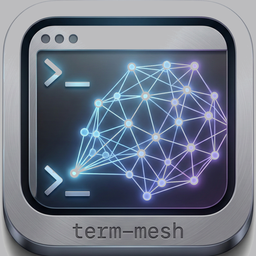
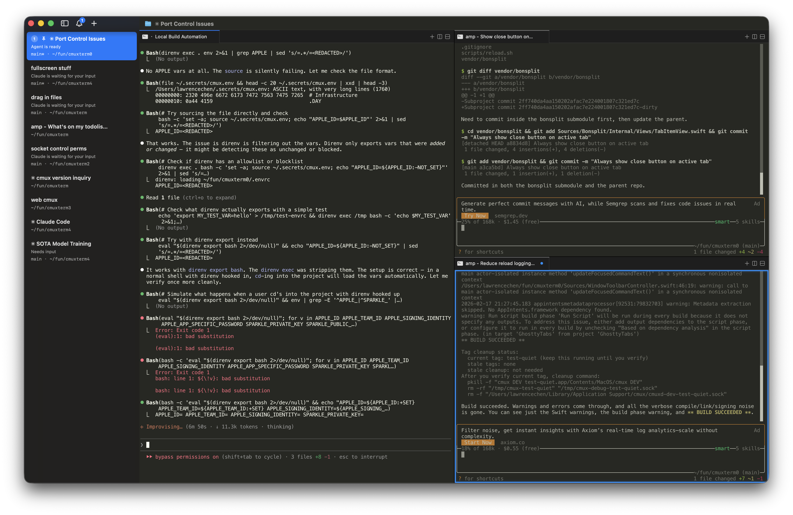

<p align="center">
  
</p>

<h1 align="center">term-mesh</h1>

<p align="center">
  <strong>AI Agent Control Plane for macOS</strong>
</p>

<p align="center">
  Run multiple AI coding agents in parallel with sandboxed worktrees, real-time resource monitoring, and a unified dashboard — all powered by a native GPU-accelerated terminal.
</p>

<p align="center">
  <a href="https://term-mesh.dev">Website</a> &middot;
  <a href="https://github.com/x-mesh/term-mesh/releases/latest">Download</a> &middot;
  <a href="#features">Features</a> &middot;
  <a href="#quick-start">Quick Start</a>
</p>

<p align="center">
  <a href="https://github.com/x-mesh/term-mesh/releases/latest"></a>
</p>

---

<p align="center">
  
</p>

## Features

### Sandbox Worktree Orchestration
Agents get physically isolated `git worktree` environments. Each agent session runs in its own directory, preventing accidental modifications to the main repository. Worktrees are automatically cleaned up when tabs close.

### Multi-Agent Native Terminal
Built on [Ghostty](https://ghostty.org) (libghostty) for Metal GPU-accelerated terminal rendering. Vertical sidebar tabs show git branch, working directory, and notification status for each agent session.

<p align="center">
  
</p>

### Notification Rings
Visual notification rings on sidebar tabs alert you when agents need attention — completed tasks, errors, or prompts waiting for input.

<p align="center">
  
</p>

### Built-in Browser
Open web pages, documentation, or dashboards directly in a split panel without leaving the terminal.

<p align="center">
  
</p>

### Budget Guard & Resource Monitoring
- **CPU/Memory monitoring** with automatic process discovery
- **SIGSTOP/SIGCONT** process control when thresholds are exceeded
- **Real API cost tracking** by parsing Claude Code's JSONL logs with incremental reads
- Model-specific pricing: Opus $5/$25, Sonnet $3/$15, Haiku $1/$5 per MTok

### File Access Heatmap
FSEvents-based file watcher tracks create/modify/remove events across watched directories. The dashboard renders a heatmap with top-10 hot files, recent events, and per-minute timeline buckets.

### Real-time Dashboard
Monitoring dashboard available as a **split panel** in-app (Cmd+Shift+D) or **standalone browser** at `http://localhost:9876`.

### Socket API
Full control via Unix socket and HTTP REST API — automate tab creation, pane management, notifications, and more from scripts or other tools.

## Architecture

```
┌──────────────────────────────────────────────────────────┐
│                   term-mesh (macOS App)                   │
│                                                          │
│  ┌─────────────────┐  ┌──────────────────────────────┐  │
│  │  Native Shell   │  │     Dashboard (WKWebView)    │  │
│  │  Swift + AppKit  │  │     Chart.js + HTTP Poll     │  │
│  │                 │  │     http://localhost:9876     │  │
│  │  Vertical Tabs  │  │                              │  │
│  │  Split Panes    │  │  ┌────────┐ ┌────────────┐  │  │
│  │  Notifications  │  │  │CPU/Mem │ │ File       │  │  │
│  │                 │  │  │Monitor │ │ Heatmap    │  │  │
│  ├─────────────────┤  │  ├────────┤ ├────────────┤  │  │
│  │ Terminal Engine  │  │  │API Cost│ │ Agent      │  │  │
│  │ libghostty      │  │  │Tracker │ │ Status     │  │  │
│  │ (Metal GPU)     │  │  └────────┘ └────────────┘  │  │
│  └─────────────────┘  └──────────────────────────────┘  │
│          │                         │                     │
│          │    Unix Socket / HTTP   │                     │
│          └───────────┬─────────────┘                     │
│                      ▼                                   │
│  ┌──────────────────────────────────────────────────┐   │
│  │              term-meshd (Rust Daemon)             │   │
│  │                                                    │   │
│  │  Worktree (git2)  │  Monitor (sysinfo)            │   │
│  │  Watcher (notify)  │  Usage (JSONL parsing)        │   │
│  │  Budget Guard (SIGSTOP/SIGCONT)                    │   │
│  └──────────────────────────────────────────────────┘   │
└──────────────────────────────────────────────────────────┘
```

## Install

### Homebrew (recommended)

```bash
brew install --cask x-mesh/tap/term-mesh
```

The cask downloads the latest DMG from [GitHub Releases](https://github.com/x-mesh/term-mesh/releases), copies `term-mesh.app` into `/Applications`, and strips the Gatekeeper quarantine attribute automatically — so the unsigned build launches without a manual `xattr` step.

Bundled CLI helpers (`tm-agent`, `term-mesh-run`) are symlinked to `$(brew --prefix)/bin`.

Upgrade / uninstall:

```bash
brew upgrade --cask term-mesh
brew uninstall --cask term-mesh           # remove the app
brew uninstall --cask --zap term-mesh     # also remove ~/Library data and ~/.term-mesh
```

#### "App already exists" on first install

If you previously installed term-mesh manually (e.g. by dragging the DMG) and then run `brew install --cask`, Homebrew refuses to overwrite the existing bundle:

```
Error: It seems there is already an App at '/Applications/term-mesh.app'.
```

Either pass `--force` to let Homebrew take over the existing app:

```bash
brew install --cask --force x-mesh/tap/term-mesh
```

…or move the existing app out of the way first:

```bash
mv /Applications/term-mesh.app ~/Downloads/term-mesh.app.manual-backup
brew install --cask x-mesh/tap/term-mesh
```

Quit any running term-mesh instance before either command.

### DMG (manual)

Grab `term-mesh-macos-<version>.dmg` from the [latest release](https://github.com/x-mesh/term-mesh/releases/latest), open it, and drag `term-mesh.app` into `/Applications`. Because the build is not notarized, run once after copying:

```bash
xattr -dr com.apple.quarantine /Applications/term-mesh.app
```

Auto-updates (Sparkle) handle subsequent versions.

## Prerequisites

| Component | Version | Notes |
|-----------|---------|-------|
| macOS | 13 Ventura+ | Metal 2 required |
| Xcode | 15+ | Swift 5.9+ |
| Rust | stable 1.75+ | edition 2021 |
| Zig | 0.15+ | For libghostty build |

## Quick Start

```bash
# 1. Clone and setup
git clone https://github.com/x-mesh/term-mesh.git && cd term-mesh

# 2. Build libghostty + native app
./scripts/setup.sh
./scripts/reload.sh --tag dev

# 3. Run daemon only (for development)
cd daemon && cargo run --bin term-meshd
```

## CLI Usage

The `term-mesh` CLI controls the app via Unix socket. Install location: `~/bin/term-mesh`

### Running Commands (PTY Wrapper)

```bash
term-mesh run claude code                    # Run Claude Code in PTY wrapper
term-mesh run -- kiro-cli chat "fix this"    # Run any command
term-mesh run --sandbox claude code          # Run in isolated git worktree
```

### Window & Workspace Management

```bash
term-mesh list-windows                       # List all windows
term-mesh new-window                         # Open a new window
term-mesh list-workspaces                    # List workspace tabs
term-mesh new-workspace                      # Create a new workspace tab
term-mesh new-workspace --command "htop"     # New workspace running a command
term-mesh select-workspace --workspace 2     # Switch to workspace by index
term-mesh rename-workspace "My Project"      # Rename current workspace
term-mesh close-workspace --workspace 3      # Close a workspace tab
term-mesh current-workspace                  # Show active workspace info
```

### Panes & Splits

```bash
term-mesh new-split right                    # Split right (terminal)
term-mesh new-split down                     # Split down
term-mesh new-split right --type browser --url https://example.com
                                             # Split with browser panel
term-mesh list-panes                         # List panes in current workspace
term-mesh focus-pane --pane 2                # Focus a specific pane
term-mesh new-pane --type browser --url https://docs.dev
                                             # Add browser tab to current pane
term-mesh close-surface --surface surface:5  # Close a surface (tab in pane)
term-mesh close-surface --surface surface:5 --close-pane
                                             # Close surface and collapse pane
```

### Terminal Input & Output

```bash
term-mesh send "ls -la"                      # Send text to terminal
term-mesh send-key Enter                     # Send a key press
term-mesh read-screen                        # Read visible terminal content
term-mesh read-screen --scrollback --lines 500
                                             # Read scrollback buffer
term-mesh capture-pane                       # tmux-compatible capture
```

### Built-in Browser

```bash
term-mesh browser open https://github.com   # Open browser in new split
term-mesh browser navigate https://docs.dev  # Navigate existing browser
term-mesh browser eval 'document.title'      # Execute JavaScript
term-mesh browser snapshot                   # Get DOM snapshot
term-mesh browser snapshot --interactive     # Interactive DOM with selectors
term-mesh browser click '#submit-btn'        # Click an element
term-mesh browser type '#search' "query"     # Type into an input
term-mesh browser wait --selector '.loaded'  # Wait for element
term-mesh browser get title                  # Get page title
term-mesh browser get text '#content'        # Get element text
term-mesh browser back                       # Navigate back
term-mesh browser reload                     # Reload page
term-mesh browser cookies get                # Get all cookies
term-mesh browser console list               # List console messages
```

### Notifications & Sidebar Metadata

```bash
term-mesh notify --title "Done" --body "Build complete"
term-mesh set-status build "passing" --icon checkmark --color "#00ff00"
term-mesh clear-status build
term-mesh set-progress 0.75 --label "Building..."
term-mesh log --level info --source agent "Task completed"
term-mesh sidebar-state                      # Full sidebar state dump
```

### tmux Compatibility

```bash
term-mesh resize-pane --pane 2 -R --amount 10  # Resize pane right
term-mesh swap-pane --pane 2 --target-pane 3    # Swap two panes
term-mesh break-pane                             # Break pane to new workspace
term-mesh join-pane --target-pane 2              # Join pane into another
term-mesh pipe-pane --command "tee log.txt"      # Pipe pane output
term-mesh last-pane                              # Focus previous pane
term-mesh next-window                            # Next workspace
term-mesh find-window --content "error"          # Search across workspaces
```

### Handle Format

Commands accept UUIDs, short refs (`window:1`, `workspace:2`, `pane:3`, `surface:4`), or indexes. Output defaults to refs; use `--id-format uuids` or `--id-format both` for UUIDs.

```bash
term-mesh --json list-workspaces             # JSON output
term-mesh --id-format both list-panes        # Include UUIDs in output
term-mesh identify                           # Show caller's workspace/surface
```

### Environment Variables

| Variable | Description |
|----------|-------------|
| `TERMMESH_WORKSPACE_ID` | Auto-set in term-mesh terminals; default `--workspace` |
| `TERMMESH_SURFACE_ID` | Auto-set in term-mesh terminals; default `--surface` |
| `TERMMESH_SOCKET_PATH` | Override socket path (default: `/tmp/term-mesh.sock`) |
| `TERMMESH_SOCKET_PASSWORD` | Socket authentication password |

Run `term-mesh help` or `term-mesh <command> --help` for full details.

## API Reference

### HTTP REST API (port 9876)

| Method | Endpoint | Description |
|--------|----------|-------------|
| GET | `/api/monitor` | System + process snapshots, budget config, usage summary |
| GET | `/api/sessions` | Terminal sessions from the Swift app |
| GET | `/api/watcher` | File heatmap snapshot (top files, events, timeline) |
| GET | `/api/usage` | Per-session API cost and token usage |
| POST | `/api/process/stop` | SIGSTOP a process `{"pid": 1234}` |
| POST | `/api/process/resume` | SIGCONT a process `{"pid": 1234}` |
| POST | `/api/budget/auto-stop` | Toggle auto-stop `{"enabled": true}` |
| POST | `/api/watcher/watch` | Start watching a path `{"path": "/..."}` |
| POST | `/api/watcher/unwatch` | Stop watching a path `{"path": "/..."}` |

### JSON-RPC 2.0 (Unix Socket)

Socket path: `$TMPDIR/term-meshd.sock`

| Method | Description |
|--------|-------------|
| `ping` | Health check (returns `"pong"`) |
| `worktree.create` | Create a sandboxed worktree |
| `worktree.remove` | Remove a worktree by name |
| `worktree.list` | List all term-mesh worktrees |
| `monitor.snapshot` | Get system/process resource snapshot |
| `monitor.track` | Track a PID for monitoring |
| `monitor.untrack` | Stop tracking a PID |
| `process.stop` | Send SIGSTOP to a process |
| `process.resume` | Send SIGCONT to a process |
| `budget.auto_stop` | Enable/disable auto-stop |
| `watcher.watch` | Watch a filesystem path |
| `watcher.unwatch` | Unwatch a filesystem path |
| `watcher.snapshot` | Get heatmap snapshot |
| `usage.snapshot` | Get API cost/token snapshot |
| `session.sync` | Push session list from Swift app |
| `session.list` | List terminal sessions |

## Project Structure

```
daemon/
  term-meshd/src/
    main.rs          # Daemon entry point
    socket.rs        # Unix Socket JSON-RPC server
    http.rs          # HTTP/REST API server (axum)
    monitor.rs       # CPU/memory monitoring + Budget Guard
    tokens.rs        # JSONL usage tracking + cost calculation
    watcher.rs       # FSEvents file heatmap
    worktree.rs      # Git worktree orchestration
  term-mesh-cli/src/
    main.rs          # CLI entry point
    pty.rs           # PTY wrapper
Sources/
  DashboardController.swift   # WKWebView dashboard + PID tracking
  TermMeshDaemon.swift         # Swift RPC client
Resources/
  dashboard/index.html         # Dashboard UI (Chart.js)
scripts/
  setup.sh                     # Initial build setup
  reload.sh                    # Rebuild and reload
```

## Build & Test

```bash
# Run all Rust tests
cd daemon && cargo test

# Run daemon in development mode
cd daemon && cargo run --bin term-meshd

# Performance benchmarks (requires running daemon + socat)
bash daemon/scripts/bench.sh
```

## License

This project is licensed under the [GNU Affero General Public License v3.0 or later](LICENSE) (`AGPL-3.0-or-later`).

Built on [Ghostty](https://ghostty.org) by Mitchell Hashimoto.
